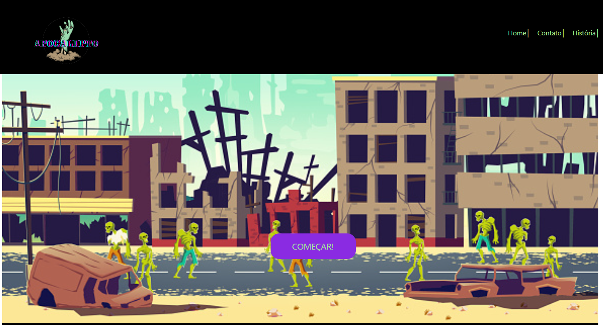
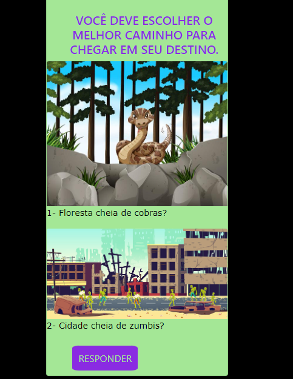
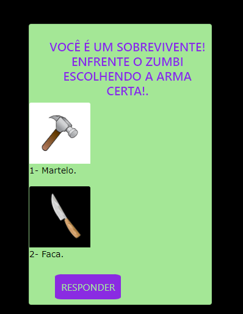
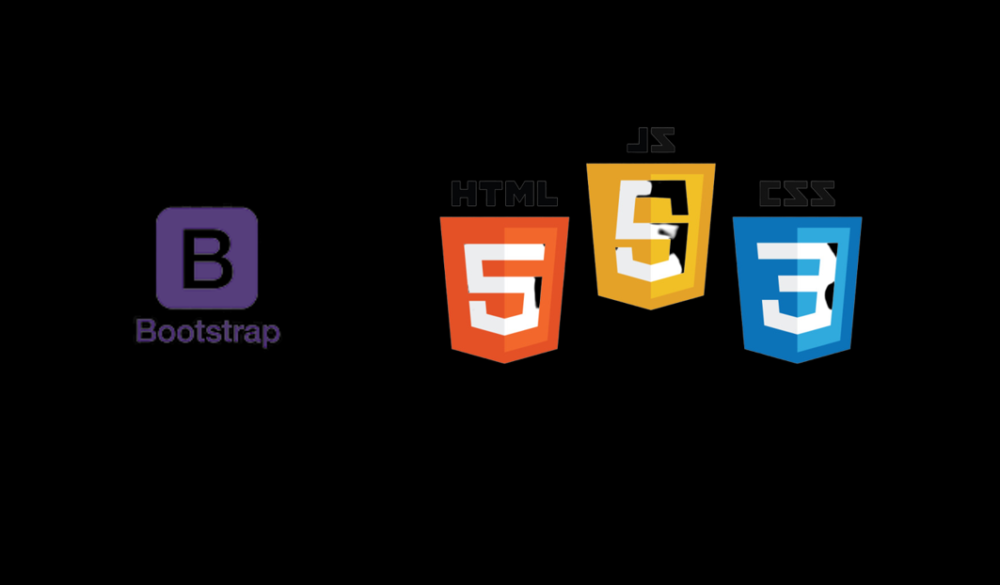

 
  

##
# PROJETO FEITO POR:

* ### Emilly <a href="https://www.linkedin.com/in/emilly-finco/" target="_blank">Linkedin <a href="https://github.com/Emillycristina" target="_blank">Github</a>
 

  
# - Módulo 1 ResiliaEducação 

##
  
> ## o JOGO
> 
> 
> 
> 
> 
>

##

> ## 👾 Tecnologias e Ferramentas Utilizadas 👾

> 
>

